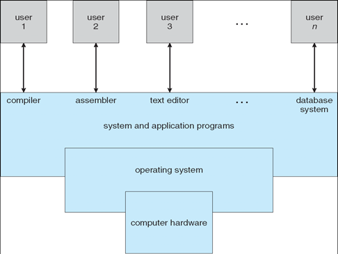
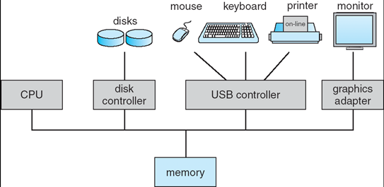
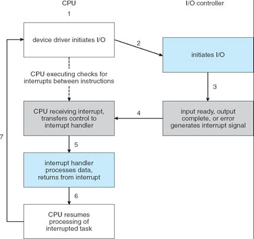
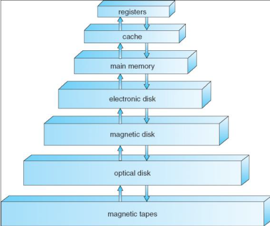
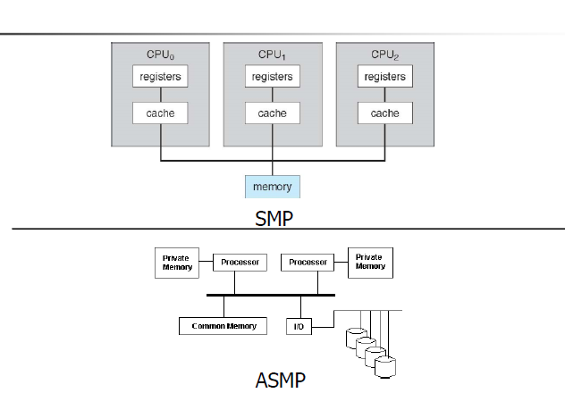

# Chapter 1. 서론

## Chapter 1 Outline

1. 운영체제의 정의

2. 컴퓨터 시스템의 구성

3. 컴퓨터 시스템의 아키텍쳐

4. 운영체제의 구조 :  멀티프로그래밍, 가상메모리, 스케줄링 등

5. 운영체제에서 수행하는 연산과 커널모드 ,유저모드에 대해

## 1.1 운영체제가  할 일

### 🔸운영체제의 역할

- **컴퓨터 하드웨어를 관리**함 
  - 컴퓨터 하드웨어에는 CPU, Main Memory, Storage, I/O devices 가 있다. 

- **프로그램 수행을 제어**함
  - 스케쥴링과 오류 보고

### 🔸운영체제의 위치

- 위의 이미지를 보면, 사용자들은 **애플리케이션 프로그램**과 **시스템 프로그램**을 통해서 **HW**에 접근하고 있다.  
- 운영체제는 HW와 애플리케이션 프로그램의 사이에 위치하여
  - **컴퓨터 하드웨어를 관리**하고 
  - 응용프로그램이 컴퓨터에 효과적으로 접근할 수 있도록 돕는다.

### 🔸운영체제의 목표

- 유저 프로그램을 실행하고 사용자 문제를 쉽게 해결한다. 
- 컴퓨터 시스템을 편리하게 사용할 수 있도록 한다. 
- 컴퓨터 하드웨어를 효율적으로 사용한다.

### 1.1.2 시스템 관점에서 본 운영체제의 역할

- **자원 할당자**(resource allocator)

  모든 리소스를 관리한다. (CPU 시간, 메모리 공간, 파일 저장 공간, I/O 장치)

  효율적이고 공정한 리소스 사용을 위해 충돌하는 요청에 리소스를 할당하는 방법을 결정한다. 

- **제어 프로그램**(control program)

  컴퓨터 시스템의 오류 및 부적절한 사용을 방지하기 위해 프로그램 실행을 제어한다. 

### 1.1.3 운영체제의 정의

- 운영체제는 컴퓨터에서 항상 실행되는 프로그램이다. (일반적으로 커널이라고 함)

  커널 외 프로그램에는 시스템 프로그램과 응용 프로그램이 있다.

  - 응용 프로그램 : 사용자 목적에 맞춰서 수행되는 게임, 워드프로세서 같은 응용프로그램을 의미. (application program)

## 1.2 컴퓨터 시스템 구성(Computer-System Organization)

 - "OS is a resource manager"

   
 - 컴퓨터 시스템은 크게 4가지로 구성된다. (CPU, Storage, Memory, I/O devices)
 - 공유 메모리에 대한 액세스를 제공하는 공통 버스를 통해 하나 이상의 CPU 및 장치 컨트롤러가 연결된다.
 - 하나 또는 그 이상의 장치 컨트롤러들이 메모리를 통해서 서로간에 인터랙션을 하고 있다.
 - 예시
   -  프로그램을 수행하기 위해서는 프로그램이 디스크로부터 읽어들여서 메인 메모리에 반드시 저장되어야 한다.
   -  키보드로부터 읽혀진 데이터들은 메모리에 저장되어 cpu가 이를 해석해서 수행해야한다.
 - 즉, 컴퓨터 시스템은 CPU 또는 디바이스들이 메모리 사이클을 차지하기 위해서 서로 경쟁한다.

### 🔸컴퓨터 시스템의 작동방식

 - 네 가지 주요 원칙

### 1.2.0 Computer system I/O operation

- IO연산이란 데이터가 메인메모리에서부터 장치 컨트롤러, 또는 장치 컨트롤러에서 메인메모리로 이동하는 연산이다.

- 각 장치 컨트롤러는 특정 유형의 장치를 담당한다.

  - 각 장치 컨트롤러에는 로컬 버퍼가 있다. 

- I/O: 데이터가 로컬 버퍼에서 메인 메모리로 이동된다.

- 장치와 CPU가 동시에 실행될 수 있다.

  - 어떻게? **DMA**(Direct Memory Access) 

    - DMA란 ? 디바이스가 어떠한 간섭 없이 IO 트랜잭션을 할 수 있는 프로세스를 말한다.

      요청이 필요할 때 CPU는 명령을 알려준다.

      그 후부터는 IO가 간섭 없이 이루어지므로 그 사이에 CPU는 유용한 일, 즉 프로그램 수행을 할 수 있다.

- 장치 컨트롤러는 인터럽트를 발생시켜 작업이 완료되었음을 CPU에 알린다.

### 1.2.1 인터럽트(Interrupt)

- DMA덕분에 IO트랜젝션와 CPU의 프로그램 수행이 병렬적으로 수행 가능하다. 

  IO트랜젝션이 끝났을 때 CPU가 알려줘야 되는데, 그 때 사용되는 메카니즘이 인터럽트이다.

  

- 인터럽트 과정

  - 디바이스 드라이버가 IO를 인식한다. 
  - IO컨트롤러에서 트랜잭션이 일어나고, 그 사이에 CPU가 다른 유용한 IO트랜젝션을 완료하게 되면 인터럽트를 통해 CPU에게 알려준다. 
  - CPU는 인터럽트를 받자마자 무조건적으로 현재 수행중이던 인스트럭션을 멈추고 그 인터럽트에 해당하는 인터럽트 핸들러를 사용하게 되어있다.
  - 인터럽트 서비스 루틴이 끝나면, 수행이 멈추었을 때 인스트럭션의 주소를 인터럽트 벡터에 저장해놨기 때문에 해당 위치에서부터 재수행이 가능하게 되어있다.

- 인터럽트와 트랩의 차이

  - 트랩 : SW에서 발생되는 인터럽트. synchronous. 예) 익셉션.

  - 인터럽트 : 외부 디바이스에서 발생되는 인터럽트. asynchronous.

    예) 세그먼트, 시스템 콜(os에게 서비스를 요청하는 메커니즘)

### 1.2.2 저장장치 구조(Storage structure)

- **메인메모리**는 CPU가 직접적으로 접근할 수 있는 유일한 스토리지인 매개체다.

  따라서 프로그램을 수행하기 위해서는 디스크에서 바로 수행하지 않고 반드시 메인 메모리로 로딩을 해야한다.

- 보조기억장치(Seconedary Storage)는 데이터를 영구적으로 저장할 수 있는 매체이고, 전원을 끄더라도 데이터가 사라지지 않는 비휘발성이다.

  에전에는 마그네틱 디스크가 많이 사용되었지만 최근에는 가격대비 성능이 크게 향상되고 있는 SSD와 같은 메모리를 많이 사용한다.

   - 추가적인 특징 : Multi-processor systems

  

### 1.2.3 입출력 구조(I/O structure)

- I/O 연산은 **버스**를 통해 수행된다.

  - 버스는 주소, 데이터 및 제어 신호를 전달하는 pararrel wires의 모음이다.

  - 버스는 크게 **시스템 버스**와 **메모리 버스**로 구분이 된다.
    - **시스템 버스**는 CPU와 IO브릿지를 연결한다.
    - 시스템 버스는 주요 구성요소 사이의 주요 통신 경로이다. 
    - 하드웨어는 어느 순간이든 시스템 버스를 통해 CPU에 신호를 보내 인터럽트를 발생시킬 수 있다.)
    - **메모리 버스**는 IO브릿지와 메모리를 연결한다.

## 1.3 컴퓨터 시스템 구조(Computer-System Architecture)

- 컴퓨터 시스템 구성요소의 정의

  - CPU : 명령을 실행하는 하드웨어
  - 프로세서 : 하나 이상의 CPU를 포함하는 물리적 칩
  - 코어 : CPU의 기본 계산 단위
  - 다중 코어(multicore) : 동일한 CPU에 여러 컴퓨팅 코어를 포함함
  - 다중 처리기(multiprocessor) : 여러 프로세서를 포함함

- 멀티코어 vs 멀티프로세서 시스템

  여러개의 CPU가 사용되는 시스템은 멀티프로세서이고,

  CPU칩에 여러개 CPU코어가 내포되는 경우는 멀티코어 CPU이다.

사실상 거의 모든 시스템은 이제 다중 코어이지만, 컴퓨터 시스템의 단일 계산 단위를 가리킬 때는 일반적인 용어인 CPU를 사용한다.

하나의 CPU에 존재하는 하나 이상의 코어를 구체적으로 언급할 때 코어와 다중 코어 용어를 사용한다. 

### 1.3.2 다중 처리기 시스템(Multiprocessor Systems)

- 정의 : 여러개의 컴퓨팅 코어가 단일 칩에 상주하는 다중 코어 시스템을 포함한다. 
- 장점
  - 처리량(throughput)의 증가
  - 경제적 : 여러개의 CPU가 peripherals, stoage, 메모리를 공유할 수 있으므로.
  - 신뢰성이 높다 : 하나가 고장나더라도 다른 CPU를 통해서 프로그램 수행을 완료할 수 있다. 
- SMP와 ASMP
  - 멀티프로세서 시스템은 크게 두 가지-SMP, ASMP로 분류된다. 
  
    
  - SMP(Symmetric Multi-Processor) : 프로세서간 마스터-슬레이브 관계가 없다. 그리고 많은 경우 메모리는 여러 프로세스간 공유하여 사용된다.
  - ASMP(Asymmetric Multi-Processor) :  프로세서간 마스터-슬레이브 관계를 가진다. 마스터 프로세스는 전체 메모리에 맵을 가지고, 다른 프로세스들은 마스터 프로세스가 지시하는 대로 프로그램을 수행한다. 대부분 슬레이브 프로세스는 자신만의 private 메모리를 소유하고 프로그램을 실행할 수 있다.

가장 일반적인 멀티프로세서 시스템은 각 피어 CPU 프로세서가 운영체제 기능 및 사용자 프로세스를 포함한 모든 작업을 수행하는 SMP을 사용한다. 

- SMP는 크게 두 가지-UMA, NUMA로 나뉜다. 

  가장 큰 차이점은 CPU에서부터 RAM까지의 액세스하는데 걸리는 시간이다. 

  - UMA(Uniform Memory Access) : 어떤 CPU에서 접근하더라도 동일한 메모리 액세스 타임을 가진다. 

  - NUMA(Non-Uniform Memory Access) : 메모리 액세스 타임이 메모리 위치에 따라 달라질 수 있다. 각 CPU 또는 CPU그룹에 작고 빠른 로컬 버스를 통해 액세스되는 자체 로컬 메모리를 제공한다. 
    - 장점 : CPU가 로컬 메모리에 액세스할 때 빠른 속도를 가지고, 시스템 상호 연결에 대한 경합이 없다. 
    - 단점 : CPU가 시스템 상호 연결을 통해 원격 메모리에 액세스해야할 때 지연 시간이 증가하여 성능 저하가 발생할 수 있다. 

## 1.4  운영체제의 작동(Operating-System Operations)

### 1.4.1 다중 프로그래밍과 다중 태스킹(Multiprogramming and Multitasking)

- 목적 : CPU 및 I/O 디바이스를 항상 사용 가능으로 유지하기 위함

- 다중 프로그래밍 : CPU가 항상 한 개는 실행할 수 있도록 프로그램을 구성하여 CPU 이용률을 높이고 사용자 만족도를 높인다. 

- 프로세스 :  다중 프로그래밍에서 실행중인 프로그램을 말한다. 

- 과정 : 운영체제는 여러 프로세스를 동시에 메모리에 유지한다. 이 중 <u>하나의 프로세스</u>가 실행된다. 

  프로세스는 I/O작업과 같은 일부 작업이 완료되기를 기다려야할 수도 있다. 

  다중 프로그래밍 되지 않는 시스템에서는 CPU가 유휴상태일 수 있다. 다중 프로그래밍 시스템에서 운영체제는 단순히 다른 프로세스로 전환하여 실행한다. 

  <u>해당 프로세스</u>가 대기해야하는 경우, CPU는 다른 프로세스로 전환한다. 결국 <u>첫 번째 프로세스</u>는 대기를 마치고 CPU를 다시 돌려받는다. 하나 이상의 프로세스를 실행해야하는 한 CPU는 유휴상태가 아니다. 

## 1.5  자원 관리(Resource Management)

### 1.5.1 프로세스 관리

- 프로그램과 프로세스의 차이
  - 프로그램 : 디스크에 저장된 파일의 내용처럼, 수동적(**Passive**)인 개체. 
  - 프로세스 : 다음 수행할 명령을 지정하는 '프로그램 카운터(Program Counter)'를 가진 능동적(**Active**)인 개체.
- 운영체제의 프로세스 관리에 대한 활동(3~7장)
  - 사용자 프로세스와 시스템 프로세스의 생성과 제거
  - CPU에 프로세스와 스레드 스케줄하기
  - 프로세스의 일시중지와 재수행
  - 프로세스 동기화를 위한 기법 제공
  - 프로세스 통신을 위한 기법 제공

### 1.5.2 메모리 관리

- 운영체제의 메모리 관리에 대한 활동(9,10장)
  - 메모리의 어느 부분이 현재 사용되고 있으며 어느 프로세스에 의해 사용되고 있는지를 추적해야한다. 
  - 필요에 따라 메모리 공간을 할당하고 회수해야한다. 
  - 어떤 프로세스(또는 그 일부)들을 메모리에 적재하고 제거할 것인가를 결정해야한다. 

### 1.5.3 파일 시스템 관리

- 운영체제의 파일 관리에 대한 활동(13~15장)
  - 파일의 생성 및 제거
  - 디렉터리 생성 및 제거
  - 파일과 디렉터리를 조작하기 위한 프리미티브의 제공
  - 파일을 보조저장장치로 매핑
  - 안정적인(비휘발성) 저장 매체에 파일을 백업

### 1.5.4 대용량 저장장치 관리

- 운영체제의 보조저장장치 관리에 대한 활동(11장)
  - 마운팅, 언마운팅
  - 사용가능공간(free-space)의 관리
  - 저장장소 할당
  - 디스크 스케줄링
  - 저장장치 분할
  - 보호

### 1.5.5 캐시 관리

- 캐시와 레지스터

  - 공통점 :  어떤 명령어나 데이터를 저장해두는 저장 공간
  - 차이점
    캐시 :  **CPU와 별도**로 있는 공간이며, **메인 메모리와 CPU 간의 속도 차이를 극복**하기 위함
    레지스터 : **CPU 안에서** 연산을 처리하기 위하여 **데이터와 명령어**를 저장하는 공간. 메인 메모리를 위한 고속의 캐시로 볼 수 있다. 

- 특정 정보가 필요할 경우, 먼저 캐시에 그 정보가 있는 지 조사한다. 

  만약 캐시에 있으면, 그 정보를 캐시로부터 직접 사용한다. 

  캐시에 없다면, 메인 메모리로부터 그 정보를 가져와서 사용해야한다. 이 때 이 정보가 다음에 다시 사용될 확률이 높다는 가정하에 캐시에 저장한다. 

## 1.6 보안과 보호(Security and Protection)

- 보호 : 컴퓨터 시스템이 정의한 자원에 대해 프로그램, 프로세스, 또는 사용자들의 접근을 제어하는 기법이다.

  시행될 제어에 대한 명세와 이들을 강제 시행하는 방법을 규정하는 수단을 반드시 제공해야한다. 

  구성요소 서브시스템 간의 인터페이스에서 잠재적인 오류를 검출함으로써 시스템의 신뢰성을 증가시킨다.

- 보안 : 외부 또는 내부의 공격을 방어한다. 

  컴퓨터 시스템은 충분한 보호 기능이 있더라도 여전히 고장나거나 부적절한 접근을 허용할 수 있기 때문에 보안이 꼭 필요하다. 

## 1.7 가상화(Virtualization)

- 가상화 : 단일 컴퓨터(CPU,  메모리, 디스크 드라이브, 네트워크 인터페이스 카드 등)의 하드웨어를 여러가지 실행환경으로 추상화하여 개별 환경이 자신만의 컴퓨터에서 실행되고 있다는 환상을 만들 수 있는 기술이다. 이러한 환경은 동시에 실행되고 서로 상호 작용할 수 있는 다른 개별 운영체제로 볼 수 있다. 가상 머신의 사용자는 단일 운영체제에서 동시에 실행되는 다양한 프로세스 간에 전환할 수 있는 것과 동일한 방식으로 다양한 운영체제 간에 전환할 수 있다. 
- 에뮬레이션 : 소프트웨어로 컴퓨터 하드웨어를 시뮬레이션한다. 일반적으로 소스 CPU 유형이 대상 CPU유형과 다른 경우에 사용된다. 

## 1.8 분산 시스템

- 분산 시스템 : 물리적으로 떨어져있는 이기종 컴퓨터들의 집합. 

  분산 시스템의 컴퓨터들은 사용자가 시스템 내의 다양한 자원들을 접근할 수 있도록 네트워크로 연결되어있따. 

- 네트워크 : 두 개 이상 시스템간의 통신경로

  - 노드 간의 거리에 따라 PAN(Personal-area), LAN(Local), WAN(Wide), MAN(Metropolitan)이 있다. 

## 1.9 커널 자료구조

운영체제 구현의 중심이 되는 주제, 즉 시스템에서 데이터가 구조화되는 방법을 다룬다. 

### 1.9.1 리스트, 스택 및 큐

- 리스트 : 데이터 값들의 집단을 하나의 시퀀스로 표시
- 연결리스트 : 각 항이 다른 하나에 연결 되어있다. 
  - 단일 연결리스트, 이중 연결리스트, 원형 연결리스트 등이 있다. 

- 스택 : LIFO, 후입선출
- 큐 : FIFO, 선입선출

### 1.9.2 트리

- 트리 : 데이터 값들이 부모-자식 관계로 연결되어 데이터의 서열을 표시하는 데 사용가능하다.

  - 일반트리(general tree) : 부모는 임의의 수의 자식을 가질 수 있다.

  - 이진트리 : 부모는 최대 두 개의 자식을 가질 수 있다. 

  - 이진 탐색 트리 : 추가로 부모의 두 자식 사이에 좌측 자식<=우측자식의 순서를 요구한다. 

    한 항을 찾을때 성능이 O(n)이다.

  - 균형 이진 탐색 트리(balanced)에는 AVL트리, Red Black 트리,  B트리, B+트리, B*트리 등이 있다. 

### 1.9.3 해시 함수와 맵

- 해시 함수 : 데이터를 입력으로 받아 이 데이터에 산술 연산을 수행하여 하나의 수를 반환한다. 이 수는 그 데이터를 인출하기 위해 테이블(전형적으로 하나의 배열)의 인덱스로 사용할 수 있다. 크니 n인 리스트에서 데이터를 찾는 데 최대 O(n)의 비교가 필요한 반면, 테이블에서 해시 함수를 사용하여 데이터를 인출할 경우 O(1)만큼 좋을 수도 있다. 
- 해시 충돌 : 두 개의 서로 다른 입력이 하나의 출력 값을 가질 수 있다. 즉, 이들이 테이블의 동일 위치로 색인될  수 있다. 
- 해시 맵 : 해시 함수를 이용해 해시 맵을 구현할 수 있다. 해시 맵은 해시 함수를 사용하여 [key:value]를 매핑시킨다. 일단 매핑이 성립되면 키에 해시함수를 적용하여 해시맵으로부터 그 값을 얻을 수 있다. 

### 1.9.4 비트맵

- 비트맵 : n개의 항의 상태를 나타내는 데 사용 가능한 n개의 이진 비트의 스트링이다. 

  예를 들어 4개의 항이 있을 때, 각 자원의 가용여부를 이진 비트의 값으로 표현하면 1101이다.

  0은 자원이 사용가능함, 1은 불가능함을 표시한다. (또는 그 반대로 할 수 있다. )

  비트맵에서 i번째 위치의 값은 i번째 자원과 연관이 있다. 0,1,3번째 자원은 사용불가능하고 2번째 자원은 사용이 가능하다. 

   
