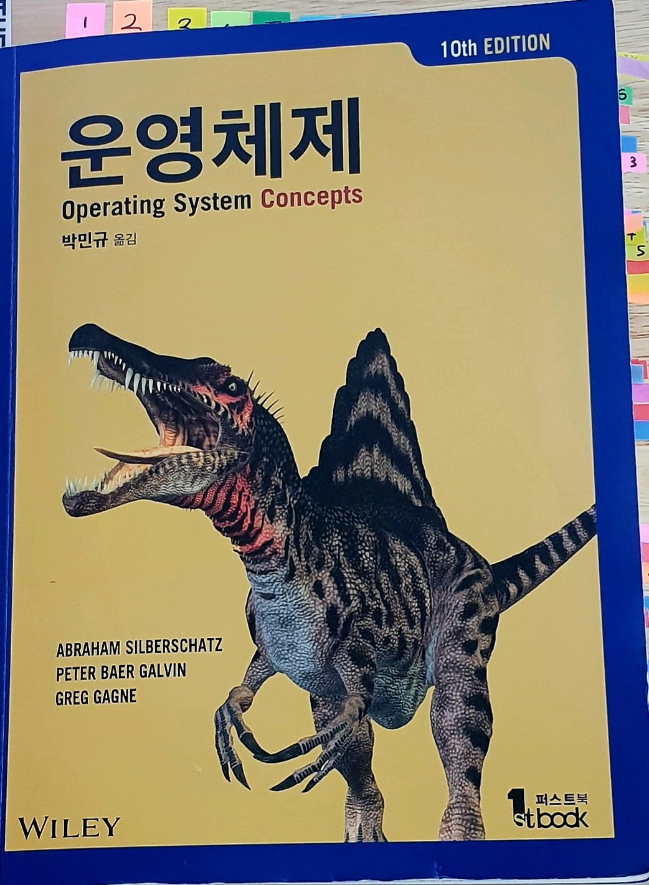

## 운영체제

## Part

1. 개관
2. 프로세스 관리
3. 프로세스 동기화
4. 메모리 관리
5. 저장장치 관리
6. 파일 시스템

 

### 진행상황

|파트|진행상태|학습시간|강의내용|계획|
| ------ | ------ | ------ | ------ | ------ |
|1| :white_large_square: |4| [1장 운영체제 개요](./1장-운영체제-개요.md) | 7/10 |
|1| :white_large_square: |2| [2장 운영체제 구조](./2장-운영체제-구조.md) | 7/11 |
|2| :white_large_square: |3| [3장 프로세스](./3장-프로세스.md) | 7/17 |
|2| :white_large_square: |2| [4장 스레드와 병행성](./4장-스레드와-병행성.md) | 7/18 |
|2| :white_large_square: |3| [5장 CPU 스케쥴링](./5장-CPU-스케쥴링.md) | 7/24 |
|3| :white_large_square: |4| [6장 동기화 도구들](./6장-동기화-도구들.md) | 7/25 |
|3| :white_large_square: |2| [7장 동기화 예제](./7장-동기화-예제.md) | 7/31 |
|3| :white_large_square: |5| [8장 교착상태](./8장-교착상태.md) | 8/1 |
|4| :white_large_square: |6| [9장 메인 메모리](./9장-메인-메모리.md) | 8/7 |
|4| :white_large_square: |4| [9장 페이징](./9장-페이징.md) | 8/8 |
|4| :white_large_square: |4| [9장 세그멘테이션](./9장-세그멘테이션.md) | 8/14 |
|4| :white_large_square: |3| [10장 가상 메모리](./10장-가상-메모리.md) | 8/15 |
|5| :white_large_square: |3| [11장 대용량 저장장치 구조](./11장-대용량-저장장치-구조.md) | 8/21 |
|6| :white_large_square: |4| [13장 파일 시스템](./13장-파일-시스템.md) | 8/22 |

 

### 교재
- 운영체제 10판  

|저자|옮긴이|출판사|출간일|
|------|------|------|------|
|Abraham Silberschatz , Peter Baer Galvin , Greg Gagne|박민규|퍼스트북|2020년 02월 28일|

 

  